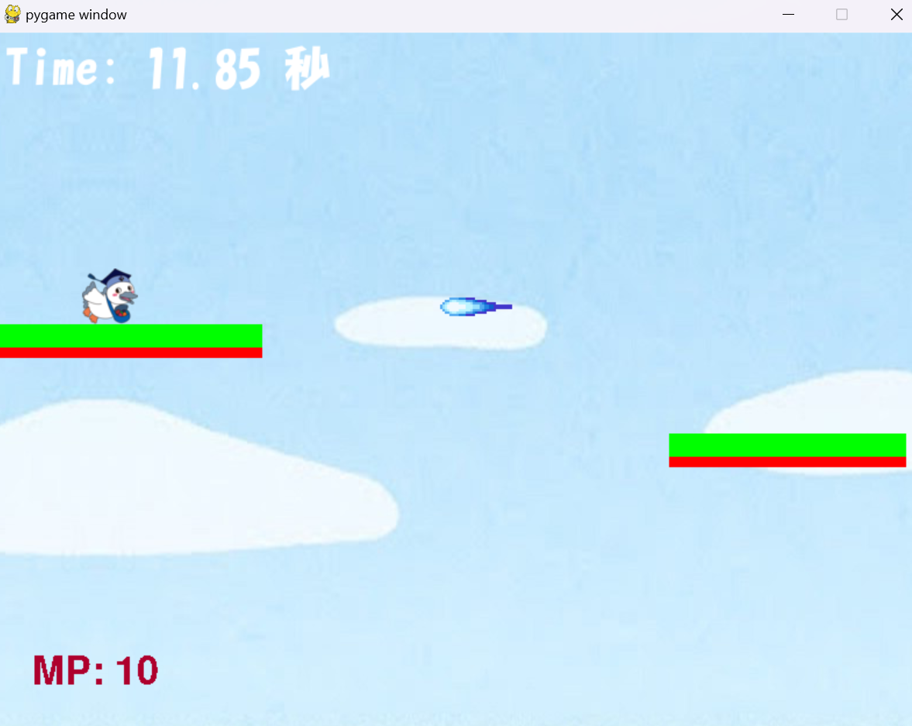

# 駆けろ！こうかとん

## 実行環境の必要条件
* python >= 3.12
* pygame >= 2.1

## ゲームの概要
* プレイヤーは「こうかとん」を操作し、ビームを避けながら落ちないように足場を飛び移り、スコア（タイム）を稼いでいくゲームです。
* 参考URL：[スクラッチでスーパーマリオランの作り方](https://bingo-ojisan.xyz/2024/07/20/supermariorun/)

## ゲームの遊び方
* スペースキー：こうかとんをジャンプさせる。ジャンプ中にさらにスペースキーを押すことで、もう一度ジャンプ（2段ジャンプ）することができる。
* Fキー（押し続ける）：空中浮遊が可能（MPを消費し続ける）
* 「こうかとん」がブロックやビームに当たったり、落ちるとゲームオーバーになる。

## ゲームの実装
### 共通基本機能
* 背景画像とこうかとんの描画
* 流れてくるブロックの描画
* 無限にジャンプが可能

### 分担追加機能
* ブロックに関する関数、２段ジャンプの追加（担当：武末）：ランダムなブロックを生成する関数、ブロックの移動のための関数、ブロックとの衝突判定をする関数、２段ジャンプ機能の導入、効果音の追加
* ビームが右から飛んでくる（担当：渡邉）：ビームがこうかとんに当たったらゲームが終了する  
* MP機能、浮遊機能（担当:髙野）：一定時間ごとに10増え続けるMPを追加、Fキーを押下するとMPを消費し続ける代わりに空中に浮遊が可能
* スタート画面と遊び方画面に関する機能の追加（担当：和田）：スタート画面にこうかとんを表示するクラス、タイトルなどを表示するスタート画面の関数、ルールなどを表示する遊び方画面の関数の導入
* タイムカウントの表示、ゲームオーバー画面の表示（担当：小川）：タイムのカウントについてのクラスの生成、Gameover関数の作成

### ToDo
- [ ] ブロックの上に障害物の追加
- [ ] ブロックの自由度を高めたい
### メモ
SE("mp3", ボリューム)で効果音を追加することができる